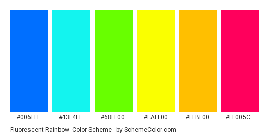
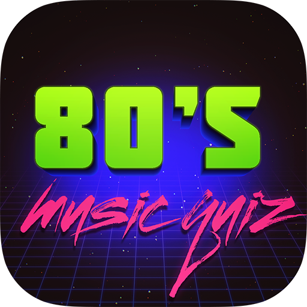

# Too much 80's music quiz

## Too much 80's is a fun website which includes a quiz and is aimed at 80's lovers and people who want to learn more about the 80's.
### Too much 80's music quiz is a fun for all website that is meant to be over the top and fun. It includes a study page which has images and links to wikipedia pages of some of the most influential musicians of the 80's. It also includes a link to spotify playlist I curated specially for this project.

## Features
1. Current features
- Ability to email me the developer
- Quiz about 80s music
- Study section where user can click on image of the band which will take them to the bands wikipedia where all my inspiration came from
- Ability to see the score in the end

2. Future features
- Add more questions
- Add more images
- Add different difficulty such as easy(Heard of the 80's), intermediate(Born in the 80's) hard(Grew up on the 80's)
- Add high scores
- Add more bands in study page
## User Experience

### Targer audience
- Quiz lovers
- 80's lovers
- People looking for a fun and simple quiz

### User stories
- As a user I am looking for easy to navigate and fun quiz 
- I love 80's music
- I want to educate myself on 80's music

### As developer
- I want to make site interactive and fun and over the top
- I want to give user choice to choose between history of bands and lyrics quiz to prevent user from becoming bored
- I want to make user nostalgic about the 80s
- I want user to navigate the site with ease

## Structure

- Nav bar which includes links to Home page, study page and contact which when clicked gives you my direct email. Nav links use a minor blur and fun colors and a small scale up function

- Home page which includes a fun and colorful section in which you can choose between a "quiz" which is about history of bands and a alternative quiz about lyrics calles "bonus game". I have used random color geberator function on mouse enter which changes colors and gives it another little over the top visual effect.

- Footer only has one link and it is for a specially curated playlist on Spotify which user can use to learn about lyrics if he/she have difficulty with bonus game part of the quiz.

- Start button and bonus game takes the user to a quiz which is very easy to navigate. Once in the quiz the question will appear and user will have to select an answer. Depending on wether the answer is correct or not user will know by clicking and seeing the message appearing over the answer itself which will read "correct" or "incorrect". Correct answer will increment the score by one and moving to next question user will know which question number they are on. Once the user completes the quiz the quiz are where questions were displayed will be replaced by using innerHTML on the main-quiz-area informing them about their score. Once that is finished user will be able to press play again which will start the quiz from scratch or study link which will take them to study page.

- Quiz itself features a fun score board, question with four answers and a question counter. Score board will inrement by one if answer is correct, question counter will increment by one and is determined by number of available questions.

- Game over message will appear over the area of the main quiz where question and answers were displayed and it will have two different messages for the user. One if all the answers are correct and other if they are not. Also the message will have play again button displayed in both cases and a study button only in case of not having a perfect score.

## Surface
### Colors
- I have used different over the top colors
- But mostly have used the following for inspiration

- Also I have used a Jonas Schmedttman code for randon color generator on home page which onmouseover changes color making the home page very over the top which was the goal

### Fonts
- I have decided to find the most retro font on google fonts and went with a more pixelated font ORBITRON which I think works well with the site
### Images
- i have only used one image as a decoration and it is on the home page 

- Other images of the bands used in study section were all taken off their wikipedia

80s image = https://apkfab.com/best-80s-music-quiz-game-80s-trivia-pop-quiz-game/com.best.eighties.music.quiz.game

## Testing
### HTML
- All HTML files passed throught w3c validator showing no errors
### CSS
- CSS file passed through w3c jigsaw showing no errors

### Javascript
- JS files passed through JS hint showing no errors

### Lighthouse report
- 

### Responsiveness
- I have used media queries where needed to achive responsiveness.

## Deployment

### GitHub Pages
To view a live preview of the site, the code has been deployed via GitHub pages. The following steps are to be followed to deploy via GitHub Pages:

- Log into GitHub.
- Navigate to the Repository.
- Click on the 'Settings' tab.
- Navigate to 'GitHub Pages' on the left-hand sidebar.
- Under 'Source', select the dropdown which will be titled 'None'.
- Select 'Main'.
- Click 'Save'.

### Forking
In order to fork the project, the following steps are to be followed:

- Log in to GitHub.
- Navigate to the repository.
- Find the 'Fork' button to the top right of the page.
- Once you click this button the fork will be in your repositories.

### Cloning
In order to clone the project, the following steps are to be followed:

- Log into GitHub.
- Navigate to the repository.
- Click on the 'Clone' button.
- You will be provided with three options to choose from, HTTPS, SSH or GitHub CLI, click the clipboard icon to copy the URL.
- Open Terminal.
- Change the current working directory to the location where you want the cloned directory.
- Type 'git clone' and paste the URL copied in step 3.
- Click 'Enter'.

## Credits
